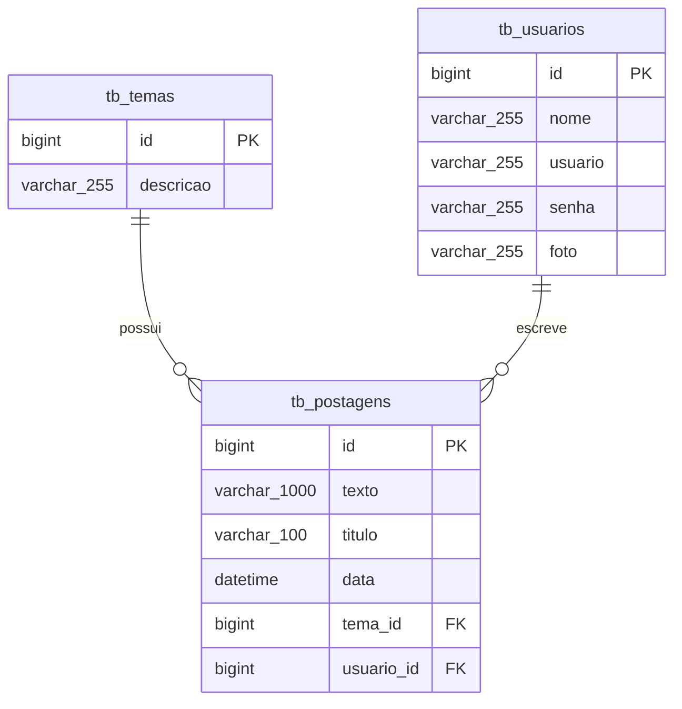

# 🚀 API Blog Pessoal - Spring Boot

[](https://www.oracle.com/java/)
[](https://spring.io/projects/spring-boot)
[](https://www.mysql.com/)
[](https://opensource.org/licenses/MIT)

API RESTful desenvolvida para uma plataforma de blog pessoal como parte do currículo do Bootcamp Full Stack da **Generation Brasil**. O sistema permite operações completas de CRUD para postagens de blog, categorias (temas) e autenticação de usuários, seguindo padrões arquiteturais REST seguros.

---

## 📌 Sumário
- [Funcionalidades](#-funcionalidades)
- [Tecnologias Utilizadas](#-tecnologias-utilizadas)
- [Arquitetura e Camadas](#-arquitetura-e-camadas)
- [Diagrama de Entidade-Relacionamento (DER)](#-diagrama-de-entidade-relacionamento-der)
- [Como Executar o Projeto](#-como-executar-o-projeto)
- [Documentação dos Endpoints (API)](#-documentação-dos-endpoints-api)
- [Estrutura do Projeto](#-estrutura-do-projeto)
- [Licença](#-licença)

---

## ✨ Funcionalidades

- **Gerenciamento de Usuários**: Cadastro, login e consulta de perfil.
- **Gerenciamento de Temas/Categorias**: Operações de CRUD para categorizar as postagens.
- **Gerenciamento de Postagens**: Operações de CRUD para os conteúdos do blog com relacionamentos com temas e usuários.
- **Integridade Referencial**: Chaves estrangeiras (FK) garantindo a consistência do banco de dados.
- **Validação de Dados**: Validação das requisições via anotações do Spring Boot Validation.

---

## 🛠 Tecnologias Utilizadas

- **Linguagem**: Java 17
- **Framework**: Spring Boot 3.x
- **Módulos**:
  - **Spring Web**: Construção de endpoints RESTful.
  - **Spring Data JPA**: Mapeamento Objeto-Relacional (ORM) e camada de acesso aos dados.
  - **Spring Validation**: Validação de dados de entrada.
- **Banco de Dados**:
  - **Desenvolvimento**: MySQL 8.0
  - **Produção**: PostgreSQL
- **Gerenciador de Dependências**: Maven

---

## 🏗 Arquitetura e Camadas

A aplicação segue rigorosamente a arquitetura limpa em três camadas:

1. **Camada Controller (`@RestController`)**: Manipula as requisições HTTP, mapeia rotas e retorna os status de resposta.
2. **Camada Service / Regra de Negócio (`@Service`)**: Contém as regras de negócio e gerenciamento de transações.
3. **Camada Repository (`@Repository`)**: Interage diretamente com o banco de dados via `JpaRepository`.

```
[ Cliente HTTP / Postman ]
        │
        ▼
   ┌──────────┐
   │ Controller│  (Processa requisições REST e retorna ResponseEntity)
   └────┬─────┘
        │
        ▼
   ┌──────────┐
   │ Repository│  (Executa consultas via Spring Data JPA)
   └────┬─────┘
        │
        ▼
   ┌──────────┐
   │ Database │  (MySQL / PostgreSQL)
   └──────────┘
```

---

## 🗄 Diagrama de Entidade-Relacionamento (DER)



---

## 🚀 Como Executar o Projeto

### Pré-requisitos

- **JDK 17** ou superior
- **Maven 3.8+**
- **Servidor MySQL 8.0+** em execução local

### Configuração e Execução Local

1. **Clone o repositório:**
   ```bash
   git clone https://github.com/seu-usuario/blog-pessoal-spring.git
   cd blog-pessoal-spring
   ```

2. **Configure a Conexão com o Banco de Dados:**
   Atualize o arquivo `src/main/resources/application.properties`:
   ```properties
   spring.datasource.url=jdbc:mysql://localhost:3306/db_blogpessoal?createDatabaseIfNotExist=true&serverTimezone=UTC
   spring.datasource.username=root
   spring.datasource.password=sua_senha
   spring.jpa.hibernate.ddl-auto=update
   spring.jpa.show-sql=true
   ```

3. **Compile e Execute a Aplicação:**
   ```bash
   mvn clean install
   mvn spring-boot:run
   ```

4. **Verifique o Status da Aplicação:**
   O servidor iniciará na porta `8080`. Acesse `http://localhost:8080/postagens` para validar os endpoints.

---

## 📑 Documentação dos Endpoints (API)

### 📝 Postagens (`/postagens`)

| Método | Endpoint | Descrição | Corpo da Requisição |
| :--- | :--- | :--- | :--- |
| `GET` | `/postagens` | Listar todas as postagens | Nenhum |
| `GET` | `/postagens/{id}` | Buscar postagem por ID | Nenhum |
| `GET` | `/postagens/titulo/{titulo}` | Buscar postagens por título | Nenhum |
| `POST` | `/postagens` | Criar uma nova postagem | Payload JSON |
| `PUT` | `/postagens` | Atualizar uma postagem existente | Payload JSON |
| `DELETE` | `/postagens/{id}` | Deletar postagem por ID | Nenhum |

#### Exemplo de Corpo de Requisição (POST / PUT)
```json
{
  "titulo": "Primeiros Passos com Spring Boot",
  "texto": "Conteúdo explicativo sobre a construção de APIs RESTful...",
  "tema": {
    "id": 1
  }
}
```

---

### 🏷️ Temas / Categorias (`/temas`)

| Método | Endpoint | Descrição | Corpo da Requisição |
| :--- | :--- | :--- | :--- |
| `GET` | `/temas` | Listar todos os temas | Nenhum |
| `GET` | `/temas/{id}` | Buscar tema por ID | Nenhum |
| `GET` | `/temas/descricao/{descricao}` | Buscar temas por descrição | Nenhum |
| `POST` | `/temas` | Criar um novo tema | Payload JSON |
| `PUT` | `/temas` | Atualizar um tema existente | Payload JSON |
| `DELETE` | `/temas/{id}` | Deletar tema por ID | Nenhum |

#### Exemplo de Corpo de Requisição (POST / PUT)
```json
{
  "descricao": "Tecnologia e Desenvolvimento"
}
```

---

## 📂 Estrutura do Projeto

```text
src/main/java/com/generation/blogpessoal/
├── controller/
│   ├── PostagemController.java
│   └── TemaController.java
├── model/
│   ├── Postagem.java
│   └── Tema.java
├── repository/
│   ├── PostagemRepository.java
│   └── TemaRepository.java
└── BlogPessoalApplication.java
```

---

## 📄 Licença

Este projeto é de código aberto e está disponível sob a licença [MIT](LICENSE).
