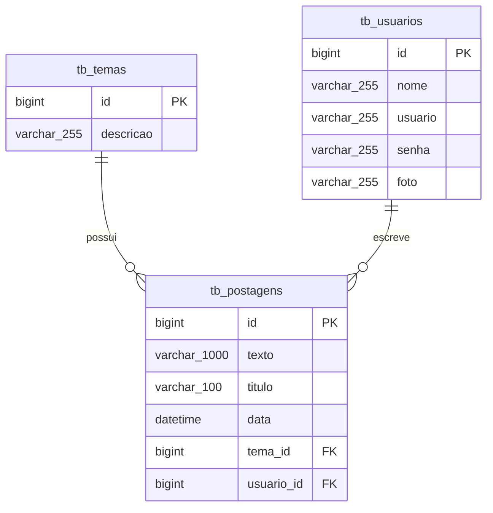

# 🚀 Blog Pessoal API - Spring Boot

[](https://www.oracle.com/java/)
[](https://spring.io/projects/spring-boot)
[](https://www.mysql.com/)
[](https://opensource.org/licenses/MIT)

RESTful API developed for a personal blogging platform as part of the **Generation Brasil** Full Stack Bootcamp curriculum. The system enables full CRUD operations for blog posts, categories (themes), and user authentication with secure REST architectural standards.

---

## 📌 Table of Contents
- [Features](#-features)
- [Tech Stack](#-tech-stack)
- [Architecture & Layers](#-architecture--layers)
- [Database Entity-Relationship Diagram](#-database-entity-relationship-diagram)
- [Getting Started](#-getting-started)
- [API Endpoints Reference](#-api-endpoints-reference)
- [Project Structure](#-project-structure)
- [License](#-license)

---

## ✨ Features

- **User Management**: User registration, login, and profile tracking.
- **Theme/Category Management**: CRUD operations to categorize blog posts.
- **Post Management**: CRUD operations for blog content with relational connections to themes and users.
- **Relational Integrity**: Foreign key constraints enforcing relational mapping between entities.
- **Data Validation**: Request payload validation using Spring Boot Validation annotations.

---

## 🛠 Tech Stack

- **Language**: Java 17
- **Framework**: Spring Boot 3.x
- **Modules**:
  - **Spring Web**: RESTful API endpoints construction.
  - **Spring Data JPA**: Object-Relational Mapping (ORM) and data access layer.
  - **Spring Validation**: Input data validation.
- **Database**:
  - **Development**: MySQL 8.0
  - **Production**: PostgreSQL
- **Build Tool**: Maven

---

## 🏗 Architecture & Layers

The application strictly follows a clean three-tier architecture:

1. **Controller Layer (`@RestController`)**: Handles HTTP requests, routes, and response status mapping.
2. **Service / Business Logic Layer (`@Service`)**: Contains core application rules and transaction handling.
3. **Repository Layer (`@Repository`)**: Interacts directly with the database via `JpaRepository`.

```
[ HTTP Client / Postman ]
        │
        ▼
   ┌──────────┐
   │ Controller│  (Handles REST requests and returns ResponseEntity)
   └────┬─────┘
        │
        ▼
   ┌──────────┐
   │ Repository│  (Executes queries via Spring Data JPA)
   └────┬─────┘
        │
        ▼
   ┌──────────┐
   │ Database │  (MySQL / PostgreSQL)
   └──────────┘
```

---

## 🗄 Database Entity-Relationship Diagram



---

## 🚀 Getting Started

### Prerequisites

- **JDK 17** or higher
- **Maven 3.8+**
- **MySQL Server 8.0+** running locally

### Local Setup & Execution

1. **Clone the repository:**
   ```bash
   git clone https://github.com/your-username/blog-pessoal-spring.git
   cd blog-pessoal-spring
   ```

2. **Configure Database Connection:**
   Update your `src/main/resources/application.properties` file:
   ```properties
   spring.datasource.url=jdbc:mysql://localhost:3306/db_blogpessoal?createDatabaseIfNotExist=true&serverTimezone=UTC
   spring.datasource.username=root
   spring.datasource.password=your_password
   spring.jpa.hibernate.ddl-auto=update
   spring.jpa.show-sql=true
   ```

3. **Build and Run the Application:**
   ```bash
   mvn clean install
   mvn spring-boot:run
   ```

4. **Verify Application Health:**
   The server will start on port `8080`. Access `http://localhost:8080/postagens` to verify endpoints.

---

## 📑 API Endpoints Reference

### 📝 Posts (`/postagens`)

| Method | Endpoint | Description | Request Body |
| :--- | :--- | :--- | :--- |
| `GET` | `/postagens` | List all posts | None |
| `GET` | `/postagens/{id}` | Get post by ID | None |
| `GET` | `/postagens/titulo/{titulo}` | Search posts by title | None |
| `POST` | `/postagens` | Create a new post | JSON Payload |
| `PUT` | `/postagens` | Update an existing post | JSON Payload |
| `DELETE` | `/postagens/{id}` | Delete post by ID | None |

#### Sample Request Body (POST / PUT)
```json
{
  "titulo": "Primeiros Passos com Spring Boot",
  "texto": "Conteúdo explicativo sobre a construção de APIs RESTful...",
  "tema": {
    "id": 1
  }
}
```

---

### 🏷️ Themes / Categories (`/temas`)

| Method | Endpoint | Description | Request Body |
| :--- | :--- | :--- | :--- |
| `GET` | `/temas` | List all themes | None |
| `GET` | `/temas/{id}` | Get theme by ID | None |
| `GET` | `/temas/descricao/{descricao}` | Search themes by description | None |
| `POST` | `/temas` | Create a new theme | JSON Payload |
| `PUT` | `/temas` | Update an existing theme | JSON Payload |
| `DELETE` | `/temas/{id}` | Delete theme by ID | None |

#### Sample Request Body (POST / PUT)
```json
{
  "descricao": "Tecnologia e Desenvolvimento"
}
```

---

## 📂 Project Structure

```text
src/main/java/com/generation/blogpessoal/
├── controller/
│   ├── PostagemController.java
│   └── TemaController.java
├── model/
│   ├── Postagem.java
│   └── Tema.java
├── repository/
│   ├── PostagemRepository.java
│   └── TemaRepository.java
└── BlogPessoalApplication.java
```

---

## 📄 License

This project is open-source and available under the [MIT License](LICENSE).
